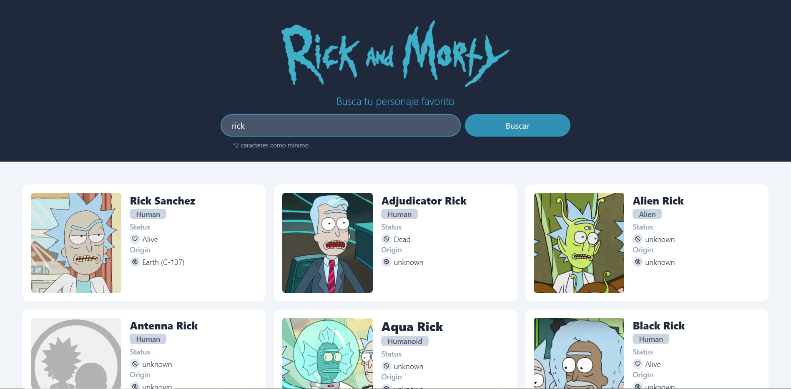

# Prueba técnica de Rick y Morty

Prueba técnica para le empresa DentOS para el cargo de Desarrollador Front End.



Desarrollado por Santiago Alvarez Eraso
## Aplicación en producción

Ingresar a la siguiente URL: [http://localhost:3000](http://localhost:3000)
## Cómo ejecutarlo localmente

Verificar la versión de Node, debe ser igual o superior a `18.15.0`. Se puede instalar con `nvm`:

```
nvm install 18.15.0
nvm use 18.15.0
```


Instalar las dependencias:

```
npm install
```


Levantar el servidor:

```
npm run dev
```


Ingresar a la siguiente URL: [http://localhost:3000](http://localhost:3000)

